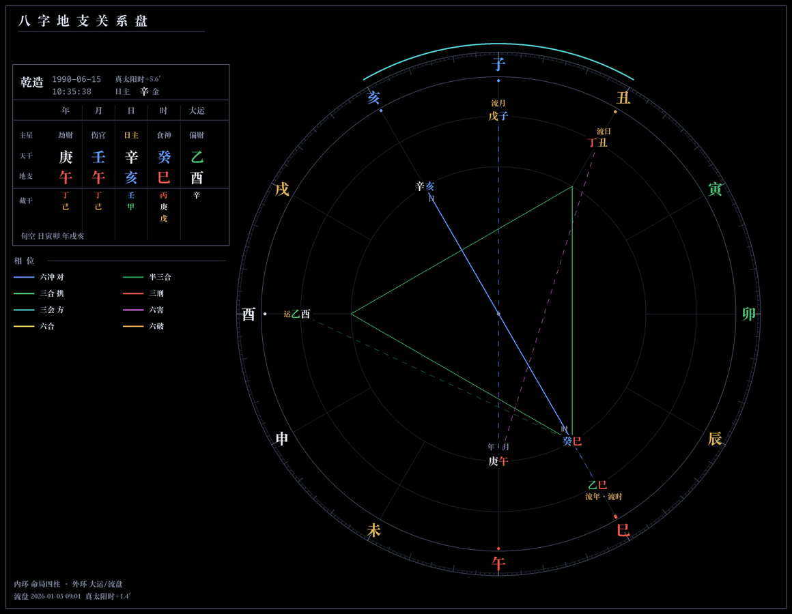
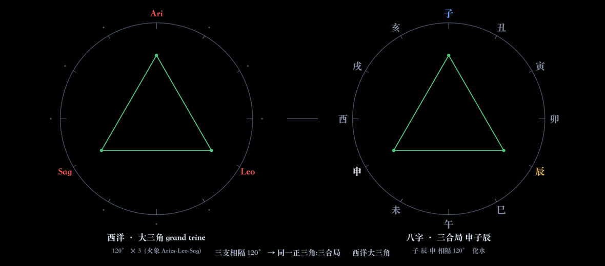

# 八字地支关系盘

地支刑冲合会的几何渲染。节气定柱、逐字五行、穿心相位线，黑底矢量，取法 [Astrolog](https://www.astrolog.org)。



## 几何

刑冲合会本是十二地支圆环上的角度关系，与西洋占星的相位同构：

| 关系 | 角度 | 西洋对应 |
| --- | --- | --- |
| 六冲 | 180° | 对分 opposition |
| 三合 | 120°×3（正三角） | 大三角 grand trine |
| 三会 | 60° 邻接 | — |
| 六合 | 定点对称弦 | 六分相 |



## 运行

```sh
python3 -m venv .venv && .venv/bin/pip install lunar_python pillow
.venv/bin/python bzserve.py            # http://127.0.0.1:8765 ，可实时流时
.venv/bin/python bzwheel.py '1990-06-15 10:30' --sex 男 --lon 121.47 --out wheel.png
```

## 构成

- `bz.py` — 计算内核：节气定柱、立春分年、十神、藏干、刑冲合会破害、三合三会三刑、空亡、大运、真太阳时。`test_core.py` 断言校验。
- `bzwheel.py` — 渲染：PIL 栅格，逐度刻度环 + 穿心相位网，3× 超采样。配色取自 Astrolog 源码 `kElemA` / `kAspB`。
- `bzserve.py` — 本地应用：实时流时 / 步进 / 走盘。

## 口径

立春分年、节令分月、子初换日（23:00）；真太阳时含均时差（近似 ±30s）。仅排盘，无判语。
